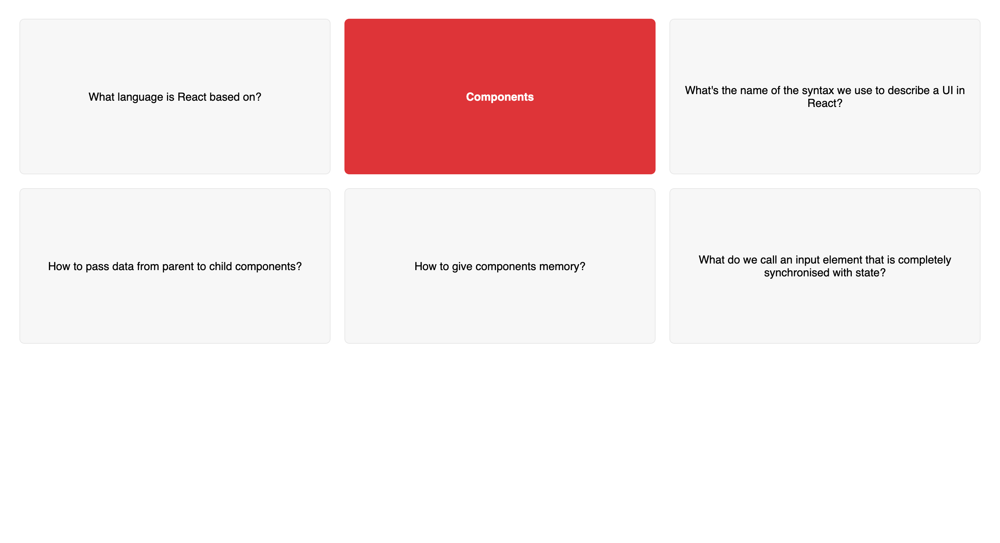

# **Walkthrough - Flashcards**

This is a small walkthrough project in the "State, Events, and Forms: Interactive Components" section of "The Ultimate React Course 2023: React, Redux & More" by Jonas Schmedtmann. 

## **1. Practiced Skills**

The goal of the project was to get some practice working with state, in particular with regard to the three key steps of:
- Creating a state variable and a related function to update it.
- Using the state variable's value.
- Updating the state variable's value.

The app features six study cards, each showing a question. The answer is revealed upon click, with a different colour being applied to the selected card. When the user clicks on a different one, then, the procedure is repeated on the new card while the old one reverts back to its original state, namely showing its question and having the original background colour. 